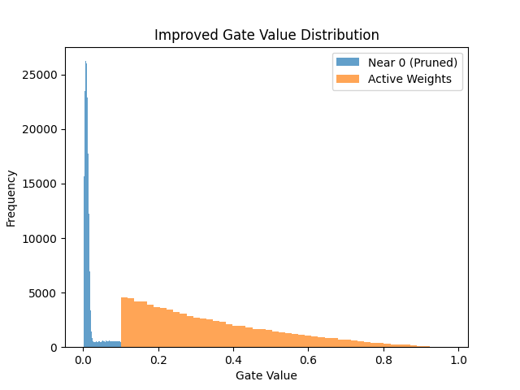

# Self-Pruning Neural Network

## 1. Introduction

In real-world scenarios, deploying large neural networks is constrained by memory and computational efficiency. Pruning is a technique used to remove unnecessary weights from a model. In this project, we implement a **self-pruning neural network** that learns to prune itself during training using a learnable gating mechanism.

---

## 2. Methodology

### 2.1 Prunable Linear Layer

A custom `PrunableLinear` layer is implemented where each weight is associated with a learnable parameter called **gate score**.

- Gate values are obtained using the sigmoid function:
  

gate = sigmoid(gate_score)

- The effective weight is:

pruned_weight = weight × gate

- If the gate approaches 0, the corresponding weight is effectively removed.

---

### 2.2Loss Function

The total loss is defined as:

Total Loss = Classification Loss + λ × Sparsity Loss

- **Classification Loss**: Cross-entropy loss
- **Sparsity Loss**: L1 norm of all gate values

The L1 norm encourages sparsity by pushing many gate values toward zero.

---

## Why L1 Regularization Encourages Sparsity

The L1 norm penalizes the absolute values of parameters. Since gate values lie between 0 and 1, minimizing their sum forces many values toward zero. This results in a sparse network where only important connections remain active.

---

## Experimental Setup

- Dataset: CIFAR-10
- Model: CNN + Prunable Linear Layers
- Optimizer: Adam
- Epochs: 10
- Batch Size: 64

---

## 3. Results

| Lambda | Test Accuracy | Sparsity (%) |
|--------|--------------|--------------|
| 1e-5   | 66.21%       | 34.61%       |
| 1e-4   | 63.43%       | 42.29%       |
| 1e-3   | 61.23%       | 51.68%       |

---

## 4. Compression Ratio

The compression ratio is calculated as:

Compression Ratio = Total Parameters / Active Parameters

- Final Compression Ratio: **1.53x**

This indicates that a significant portion of parameters can be removed while maintaining performance.

---

## 5. Observations

- Increasing λ results in higher sparsity.
- Accuracy decreases gradually as sparsity increases.
- Even at ~51% sparsity, the model retains ~61% accuracy.
- This shows that many parameters in neural networks are redundant.

---

## 6. Gate Distribution Analysis

The plot shows a strong concentration of gate values near zero, indicating that a large number of weights have been effectively pruned.

A secondary distribution of gate values spread across higher ranges represents important connections retained by the model.

This clear separation confirms that the network successfully distinguishes between redundant and useful parameters, validating the effectiveness of the self-pruning mechanism.

---
## 7. Gate Distribution Plot

The plot shows a prominent spike near zero, indicating that a large number of weights have been effectively pruned. A smaller cluster of values away from zero represents important connections retained by the network.

---

## 8. Key Insight

The model demonstrates a clear sparsity–accuracy trade-off. As the regularization strength (λ) increases, the network aggressively prunes less important weights, leading to higher sparsity. 

Interestingly, even after removing over 50% of the weights, the model retains more than 60% accuracy. This suggests that neural networks are inherently over-parameterized and can maintain performance with significantly fewer effective parameters.

---

## 9. Conclusion

The self-pruning neural network successfully learns to remove unnecessary weights during training. The use of L1 regularization effectively induces sparsity, resulting in a more efficient model without significant loss in performance.

---

## 10. Future Improvements

- Apply pruning to convolutional layers
- Use structured pruning for better hardware efficiency
- Experiment with different regularization techniques
- Train deeper architectures for improved accuracy